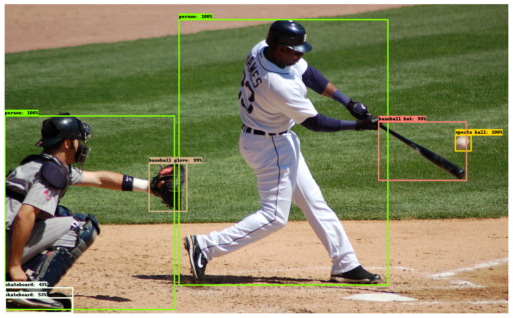
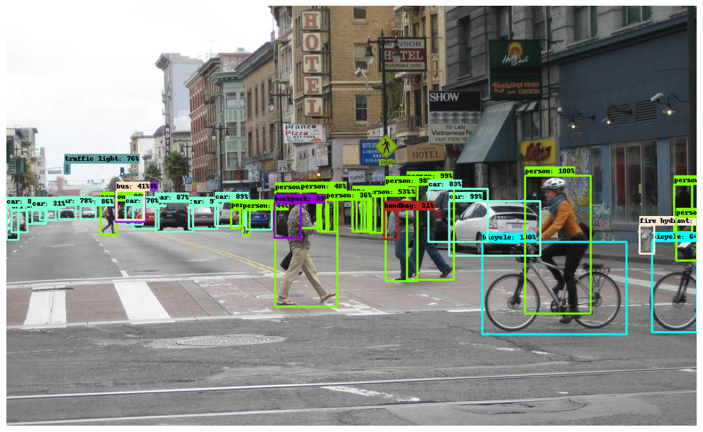

# Object Detection
Object detection model utilizes **"Faster R-CNN ResNet152 V1 800x1333"** as a pre-trained model. However, you are able to apply other pre-trained models too. In addition, we applied the model on the frames of a target video, then combined the resulting frames to create a new video.

## Resource
I have applied the Object Detection project from the **Tensorflow** documentation.  
[Resource](https://www.tensorflow.org/hub/tutorials/tf2_object_detection)

## Results
<table>
<tr>
<td></td>
<td></td> 
</tr>
<tr>
<td></td> 
<td></td> 
</tr>
</table>

