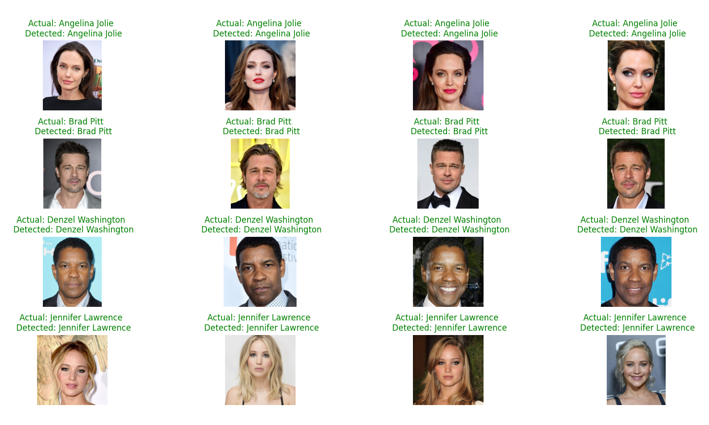

# Single-shot Face Recognition
Face Recognition which utilizes InceptionResnetV1 as a pre-trained model to extract feature vector from images. Then compare the new input images with the resource ones to count the difference.

## Data
A few inages of four celebrities have been selected. Actually, we made an effort to choose images that covers face prporly. Therefor, keep in mind the pre-trained model is a FaceNet one.

[**Download data**](https://www.kaggle.com/datasets/vishesh1412/celebrity-face-image-dataset)

## Results
We tested the approach on a few new test and the results are as follows:




## Run The Project

To run the project, run the following command

```bash
  pip install -r requirements.txt
```
then
```bash
  python app.py
```


